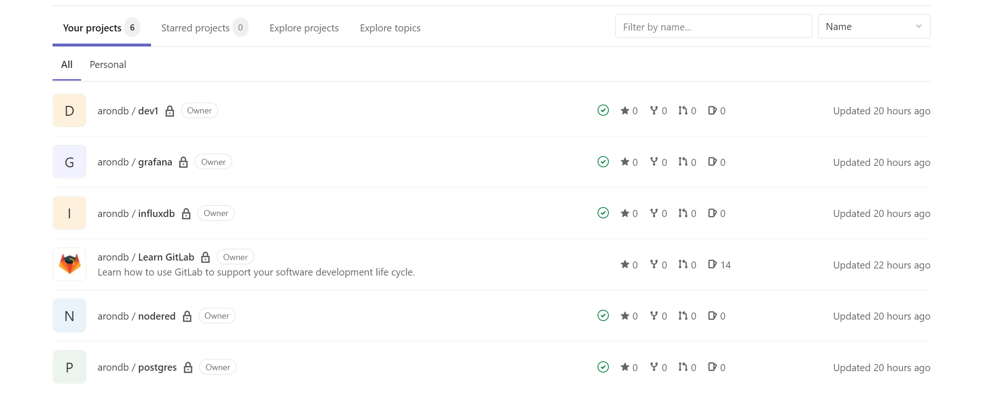
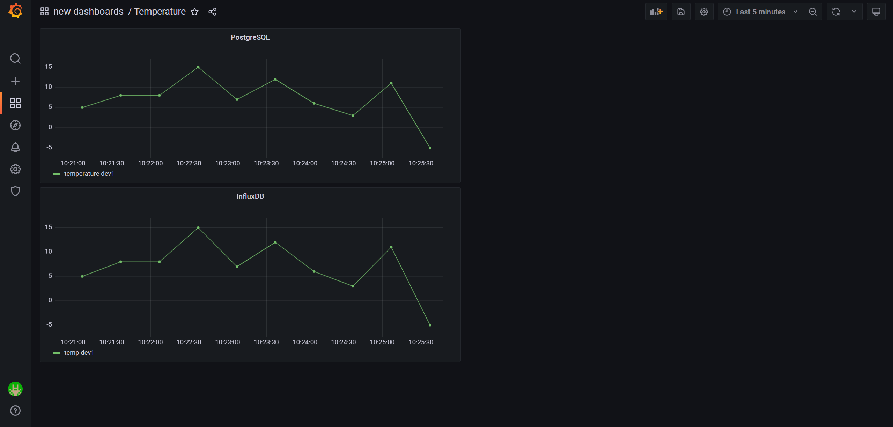
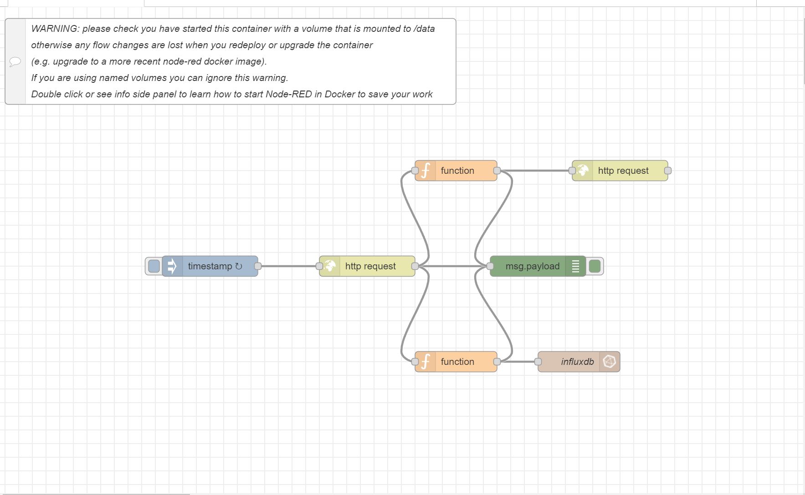

# Introduction
A tutorial project based on the https://morethancertified.com/ more than certified docker course. Used Node-Red to periodically accept information from a python script that generates a random temperature which is then sent to InfluxDB and displayed using Grafana. This information is also stored in PostgreSQL and PostgREST. A GitLab pipeline is deployed to test functionality.

# Things learned 
- Difference between CMD and Entrypoint
- Difference between builds and images and utilizing GitLab to test docker images
- Using networks in place of ports
- Important commands like docker rm $(docker ps -a -q) docker rmi $(docker images -q) docker build -t img_name . docker run -it -d -p port:port img_name
- Some experience using postgres databases and it's significance
- Best practices for containers
# Things I struggled with
- Understanding the point of GitLab to effectively be used in personal projects, I used GitLab on my personal website to just experiment with and didn't really have a database and would just test it through VisualStudio and my S3 bucket.
- Documentation documentation documentation
- Knowing exactly where to copy and send your information to
- Commands to mount your volumes
- Knowing what to put for your environment presets like mode
- Using a vpn for security

#Demo

